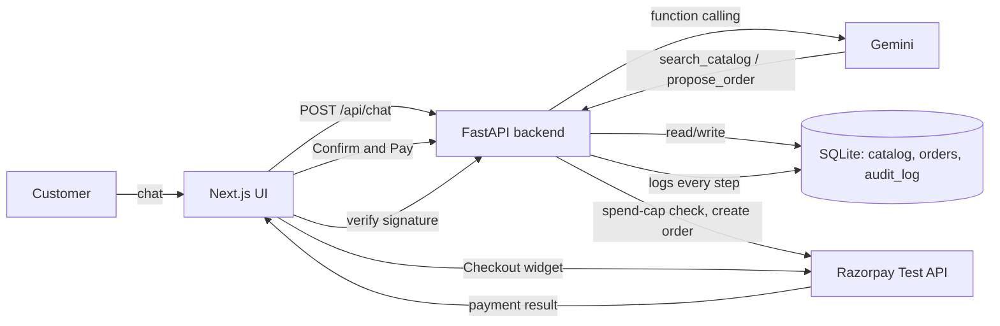

# Campus Tech Essentials — Agentic Commerce Assistant

Built for the Razorpay AI Buildathon — **Track 1: AI Growth & Agentic Commerce**.

A conversational shopping assistant that lets a customer browse a merchant's catalog and complete a real (test-mode) Razorpay payment through chat — with every money-moving action bounded, gated, and logged.

## What it does
- Chat with an AI shopping assistant (Gemini) that searches a real product catalog and proposes orders.
- Every order proposal is a **draft only** — the agent can never charge money directly.
- A separate, deterministic backend endpoint re-validates the amount against a hard spend cap before creating a real Razorpay test-mode order.
- Payment success is verified **server-side** via Razorpay signature verification — a forged "payment succeeded" callback is rejected, not trusted.
- Every action (searches, proposals, blocks, payments, failures) is written to an audit trail, visible live in the UI.

## The bar this meets
- **Bounded**: a hard spend cap (₹2,000) blocks any order above it before Razorpay is even called.
- **Gated**: the LLM can only propose; a human click + signature verification gates the real charge.
- **Explainable**: full audit trail of every action, actor, and outcome.
- **Graceful failure**: a declined/failed test payment is caught, logged, and never silently mishandled or double-charged.
- **AI judgment**: the LLM handles conversation and catalog search; it never directly authorizes a payment — that logic is plain, auditable Python.

## Stack
- Backend: Python, FastAPI, SQLite, Google Gemini API (function calling), Razorpay Python SDK
- Frontend: Next.js, TypeScript, Tailwind CSS
- No external database service, no paid APIs — free-tier only.

## Architecture



## Running it locally

### Backend
```bash
cd backend
python -m venv .venv
.venv\Scripts\Activate.ps1   # Windows
pip install -r requirements.txt
uvicorn app.main:app --reload --port 8000
```

Create a `.env` file in the project root with:
```
RAZORPAY_KEY_ID=your_test_key_id
RAZORPAY_KEY_SECRET=your_test_key_secret
GEMINI_API_KEY=your_gemini_api_key
```

### Frontend
```bash
cd frontend
npm install
npm run dev
```

Visit `http://localhost:3000`.

## What broke, and how we got out
During testing, a real payment attempt was declined ("Failure" via Razorpay's test-mode mock bank). The frontend correctly caught the `payment.failed` event, marked that message as failed without touching the order's paid status, and logged the failure to the audit trail — no crash, no false success, no double charge. Separately, the Gemini free tier's daily request quota was exhausted mid-build; the agent now automatically falls back across a short list of models instead of hard-failing the conversation.
