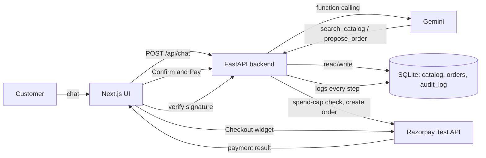

# Campus Tech Essentials — Agentic Commerce Assistant

Built for the Razorpay AI Buildathon — **Track 1: AI Growth & Agentic Commerce**.

A conversational shopping assistant that lets a customer browse a merchant's catalog and complete a real (test-mode) Razorpay payment through chat — with every money-moving action bounded, gated, and logged.

## What it does
- Chat with an AI shopping assistant (Gemini) that searches a real product catalog and proposes orders.
- Every order proposal is a **draft only** — the agent can never charge money directly.
- A separate, deterministic backend endpoint re-validates the amount against a hard spend cap before creating a real Razorpay test-mode order.
- Payment success is verified **server-side** via Razorpay signature verification — a forged "payment succeeded" callback is rejected, not trusted.
- Every action (searches, proposals, blocks, payments, failures) is written to an audit trail, visible live in the UI.

## The bar this meets
- **Bounded**: a hard spend cap (₹2,000) blocks any order above it before Razorpay is even called.
- **Gated**: the LLM can only propose; a human click + signature verification gates the real charge.
- **Explainable**: full audit trail of every action, actor, and outcome.
- **Graceful failure**: a declined/failed test payment is caught, logged, and never silently mishandled or double-charged.
- **AI judgment**: the LLM handles conversation and catalog search; it never directly authorizes a payment — that logic is plain, auditable Python.
## Proving it's actually transactable by an AI buyer
Beyond the human-facing chat UI, `backend/buyer_agent.py` is a standalone script where an AI agent - not a human in a browser - autonomously interprets a purchasing goal, searches the catalog, decides what to buy, and drives a real (test-mode) Razorpay order into existence with **zero human clicks**. It uses the exact same `search_catalog` / `propose_order` tools and hits the exact same `/confirm` endpoint as the human UI, so the same spend-cap gate protects both paths identically:

```bash
python buyer_agent.py "I need something to keep my laptop safe, budget under 1000 rupees"
# -> autonomously completes: real Razorpay order created, no human involved

python buyer_agent.py "Buy me the mechanical keyboard, price doesn't matter"
# -> autonomously BLOCKED by the same Rs.2,000 spend cap that protects the human UI
```
## Stack
- Backend: Python, FastAPI, SQLite, Google Gemini API (function calling), Razorpay Python SDK
- Frontend: Next.js, TypeScript, Tailwind CSS
- No external database service, no paid APIs — free-tier only.

## Architecture



## Running it locally

### Backend
```bash
cd backend
python -m venv .venv
.venv\Scripts\Activate.ps1   # Windows
pip install -r requirements.txt
uvicorn app.main:app --reload --port 8000
```

Create a `.env` file in the project root with:
```
RAZORPAY_KEY_ID=your_test_key_id
RAZORPAY_KEY_SECRET=your_test_key_secret
GEMINI_API_KEY=your_gemini_api_key
```

### Frontend
```bash
cd frontend
npm install
npm run dev
```

Visit `http://localhost:3000`.

## Evaluation
We ran a small, honest comparison (`backend/evaluate_agent.py`) between plain keyword search (no AI) and the real conversational agent, across two kinds of customer intent:

**Simple category lookups** (8 cases, e.g. "I want some wireless earbuds"): keyword search and the agent **tied, 8/8 each**. For straightforward single-category requests, a plain search box works just as well - the agent's advantage is not here, and we are not claiming otherwise.

**Budget / price-comparison constraints** (2 cases, e.g. "charge my phone, budget under 250 rupees", and "which is cheaper, the mouse or the keyboard - buy that one"): keyword search resolved **0/2** - it either found nothing relevant, or surfaced both the correct and incorrect option undifferentiated, since substring matching has no concept of price or comparison. The agent correctly resolved **2/2**, reading prices from the tool output and reasoning about the constraint.

This is the specific, honest place the AI adds measurable value: constraint-based product reasoning, not basic keyword lookup. We do not claim a revenue number - we do not have one measured.

## Known limitations
- **No payment webhook.** Payment success is confirmed when the browser calls back after Checkout - if a customer closes the tab before that call fires, Razorpay could capture a payment that never gets reflected as `paid` locally. A production version needs a Razorpay webhook as the source of truth, with the current client-side verification kept only as a fast-path UX optimization.
- **No authentication.** Any client can call any order endpoint. Acceptable for a single-session demo, not for a real multi-customer merchant.
- **Chat sessions are in-memory.** Conversation history resets on server restart and would not survive multiple server processes.
- **Single hardcoded merchant catalog.** No real catalog ingestion or multi-merchant support.

## What broke, and how we got out
During testing, a real payment attempt was declined ("Failure" via Razorpay's test-mode mock bank). The frontend correctly caught the `payment.failed` event, marked that message as failed without touching the order's paid status, and logged the failure to the audit trail — no crash, no false success, no double charge. Separately, the Gemini free tier's daily request quota was exhausted mid-build; the agent now automatically falls back across a short list of models instead of hard-failing the conversation.
A closer audit of the confirm-order flow also surfaced a real concurrency bug: two simultaneous confirm requests for the same order could both pass the status check before either updated it, each creating a separate real Razorpay order. We fixed this with an atomic conditional `UPDATE` (claim the order before calling Razorpay; only one concurrent request can win) and wrote an automated test (`backend/test_race_condition.py`) that fires two simultaneous requests and asserts only one Razorpay order is ever created.